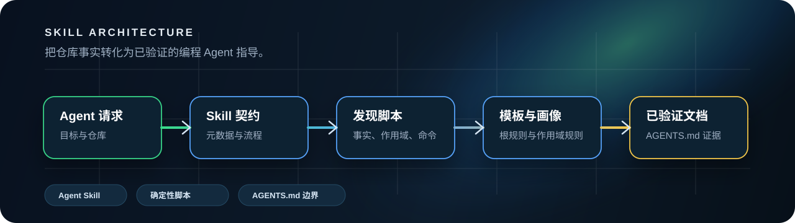
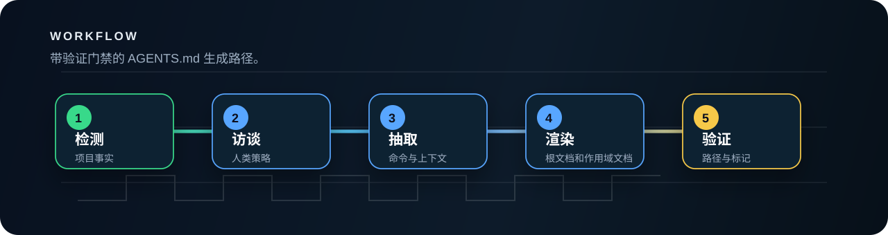

<p align="center">
  <a href="README.md">English</a>
  <span>&nbsp;|&nbsp;</span>
  <a href="README-CN.md"><strong>中文</strong></a>
</p>

<p align="center">
  
</p>

<p align="center">
  <a href="LICENSE"></a>
  <a href="pyproject.toml"></a>
  
  <a href="SKILL.md"></a>
  <a href="references/script-guide.md"></a>
</p>

<h1 align="center">AGENTS.md Generator</h1>

<p align="center">
  面向 Codex/Agent 的 AGENTS.md 生成与验证 Skill。
</p>

AGENTS.md Generator 用来把 AI 编程代理变成更可靠的仓库 onboarding 助手。它提供触发元数据、操作流程、模板、确定性发现脚本、设计画像问题和验证门禁，帮助 Agent 从仓库事实稳定推进到可验证的 `AGENTS.md` 指导文件。

这个仓库首先是一个 **Agent Skill Package**。Python 脚本是确定性执行层，但主要入口是 Agent 可加载、可遵循的 skill 结构。

## 为什么需要它

Agent 规则文件如果靠记忆编写，很容易过期或失真。AGENTS.md Generator 要求 Agent 先检查仓库事实，只询问缺失的人类策略，再渲染聚焦的根目录或作用域 `AGENTS.md`，并在声明草稿就绪前验证路径和命令。

适用场景包括：

- 为 Codex 和其他编程 Agent 创建根目录或作用域 `AGENTS.md`。
- 梳理仓库 onboarding 规则、命令发现和本地策略。
- 为 skill 或工程项目生成 strong-control profile。
- 在用户要求时创建 CLAUDE.md 和 GEMINI.md 兼容 shim。
- 检查陈旧 Agent 文档、命令真实性和引用路径。

## Skill 架构

<p align="center">
  
</p>

## 工作流

<p align="center">
  
</p>

## 仓库结构

| 路径 | 作用 |
| --- | --- |
| `SKILL.md` | 面向 Agent 的触发、流程、约束和验证规则。 |
| `agents/openai.yaml` | Skill 列表和调用入口的 UI 元数据。 |
| `scripts/` | 项目检查、设计画像采集、渲染、验证、审计和 shim 创建脚本。 |
| `assets/templates/` | root/scoped `AGENTS.md` 渲染模板。 |
| `references/` | 脚本指南、审查清单、问题库、覆盖说明和 AGENTS.md 指导。 |

## 快速开始

把本仓库放入 Codex skill 搜索路径即可作为 Agent Skill 使用。做本地检查或仓库分析时：

```powershell
python scripts/inspect_project.py <project>
python scripts/detect_scopes.py <project>
python scripts/collect_design_profile.py <project>
python scripts/extract_commands.py <project>
python scripts/extract_context.py <project>
python scripts/render_agents.py <project>
python scripts/verify_agents.py <project>
python scripts/audit_skill.py .
```

Strong-control 生成依赖设计画像。先运行设计访谈，把答案保存为 JSON，再用生成的 profile 渲染：

```powershell
python scripts/collect_design_profile.py <project> --kind skill
python scripts/collect_design_profile.py <project> --answers answers.json --write
python scripts/render_agents.py <project> --profile <project>/.agents/agents-control.json
python scripts/verify_agents.py <project>
```

兼容 shim 需要显式选择：

```powershell
python scripts/create_agent_shims.py <project>
```

## 边界

- 生成和审查 AI 编程 Agent 上下文文件，不替代通用项目文档。
- 从仓库文件发现的命令只是候选命令，只有实际运行后才能称为已验证。
- 保留 managed generated blocks 外的手写内容。
- 不编造仓库策略、owner、CI 行为、分支名或安全规则。
- 本地密钥、私有基础设施、生成缓存和机器专属路径不应进入生成指导。

## 机构说明

Jiyuan Liu 和 He Li 隶属于东南大学电子科学与工程学院。
两位作者所在团队为东南大学电子科学与工程学院异构智能与量子计算实验室（HIQC课题组），相关工作面向异构智能、量子计算及相关计算系统研究。

## 联系方式

问题、合作或学术使用，请联系：[erie@seu.edu.cn](mailto:erie@seu.edu.cn)。

## 引用

本 skill 由东南大学电子科学与工程学院异构智能与量子计算实验室（HIQC课题组）相关作者维护。

如果本 skill 对你的研究、教学或工程流程有帮助，请引用。规范引用元数据以 [CITATION.cff](CITATION.cff) 为准。

```bibtex
@software{liu_2026_agents_md_generator,
  author       = {Jiyuan Liu and He Li},
  title        = {{AGENTS.md Generator}: An Agent Skill for Coding-Agent Context Files},
  year         = {2026},
  version      = {0.4.6},
  date         = {2026-05-11},
  url          = {https://github.com/Eriemon/agents-md-generator},
  license      = {Apache-2.0},
  note         = {Agent skill package for generating and verifying AGENTS.md files}
}
```

## 许可证

Apache License 2.0，详见 [LICENSE](LICENSE)。
