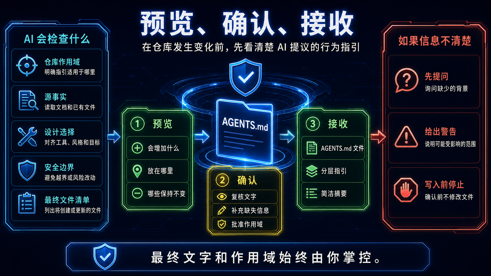

<p align="center">
  <a href="README.md">English</a>
  <span>&nbsp;|&nbsp;</span>
  <a href="README-CN.md"><strong>中文</strong></a>
</p>

<p align="center">
  
</p>

<p align="center">
  <a href="LICENSE"></a>
  <a href="pyproject.toml"></a>
  
  <a href="SKILL.md"></a>
  <a href="references/script-guide.md"></a>
</p>

<h1 align="center">AGENTS.md Generator</h1>

<p align="center">
  支持 Codex、Claude、Gemini、DeepSeek 四类 harness（运行载体）的技能：把真实仓库整理成 AI 编程助手能够遵循的清晰、分层说明。
</p>

<p align="center">
  发布日期：2026-08-24
</p>

## 有什么用

当 AI 编程助手需要先理解仓库再修改代码时，可以使用本技能。它会识别目录、语言、工具和已有说明，再帮助你整理简洁的根目录及子目录 `AGENTS.md` 规则。最终得到的是一层更容易让 AI 遵循、也更方便人检查的仓库上下文。


## 安装

让 AI 安装 https://github.com/Eriemon/agents-md-generator 中的技能。

安装前，让助手展示它找到的来源、准备新增的文件和目标技能名称。预览与意图不一致时，可以在写入前停止。

手动执行命令见下方的 Skill 开发包说明。

## 需要准备什么

- 打开你希望助手理解的目标仓库。
- 确保助手可以读取仓库及已有说明文件。
- 想好哪些目录共享规则，哪些目录需要单独规则。
- 不要把私密凭据或生成的构建输出放进要求助手检查的材料中。

## Skill 开发包

Skill 包提供 `assets/installer/install.ps1`、`install.sh` 和 `install.bat`，支持 Codex、Claude、Gemini、DeepSeek 四类 harness。从解压后的版本化发布包根目录可以手动执行：

```powershell
.\assets\installer\install.ps1
```

```bat
cmd /c call .\assets\installer\install.bat
```

```bash
./assets/installer/install.sh
```

只预览、不写入文件时，PowerShell/BAT 追加 `-DryRun`，shell 追加 `--dry-run`。入口读取由 `config/agent-platforms.json` 生成的哈希绑定投影，使用英文引导选择平台，并在写入前检查项目类型、目标路径、投影/目录摘要、路径 containment 和覆盖确认。

安装器只随 Skill-development 包提供；Engineering 项目会在任何写入前被拒绝。BAT 只是 PowerShell 转发入口。

```powershell
.\assets\installer\install.ps1 -DryRun
```

```bash
./assets/installer/install.sh --dry-run
```

## 如何调用

安装后，让 AI 编程助手在当前仓库中使用 `AGENTS.md Generator`。可以这样说：“请先检查这个仓库，概括你看到的事实，再提出分层的 `AGENTS.md` 说明供我审阅。”


## 预览与确认

检查助手提出的目录、规则作用域、继承关系和文字。仍在预览阶段时可以要求修改；只有当说明准确描述了你要维护的仓库后再确认。


## 最终得到什么

- 一份供整个仓库共享的根目录 `AGENTS.md`。
- 可选的子目录 `AGENTS.md`，承载更窄范围的规则。
- AI 可以刷新而不会抹掉你自己补充内容的受管区块。
- 一份清晰的决策和改动文件摘要，便于交接。



## 作者与引用

Jiyuan Liu 和 He Li 来自东南大学（Southeast University）电子科学与工程学院。本项目与 Heterogeneous Intelligence and Quantum Computing Laboratory（HIQC）共同开发。

如果你的工作使用了本技能，请通过 [CITATION.cff](CITATION.cff) 引用：

```bibtex
@software{liu_2026_agents_md_generator,
  author = {Jiyuan Liu and He Li},
  title = {{AGENTS.md Generator}: An Agent Skill for Coding-Agent Context Files},
  year = {2026},
  version = {3.0.1},
  date = {2026-08-24},
  url = {https://github.com/Eriemon/agents-md-generator},
  license = {Apache-2.0}
}
```

本技能采用 Apache License 2.0。请阅读 [LICENSE](LICENSE)、[CONTRIBUTING.md](CONTRIBUTING.md)、[SECURITY.md](SECURITY.md) 和 [CITATION.cff](CITATION.cff)。
