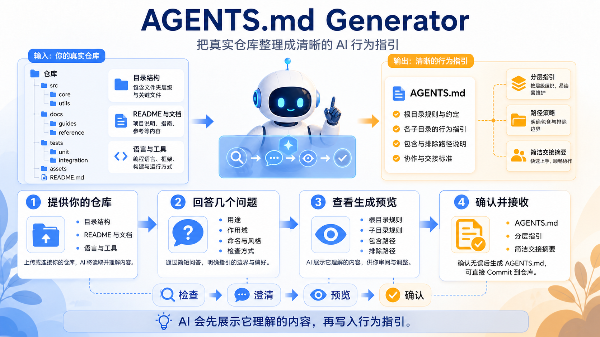
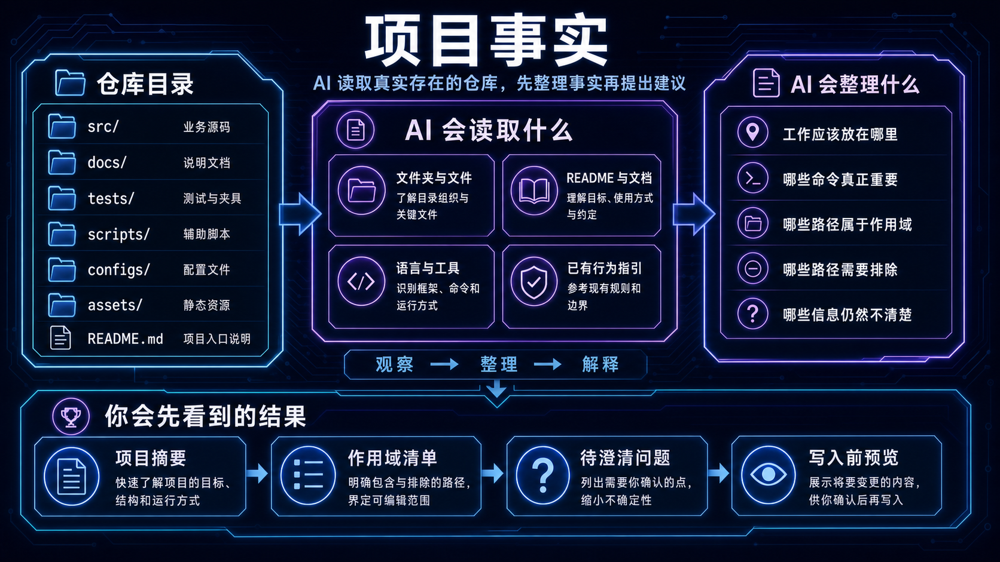
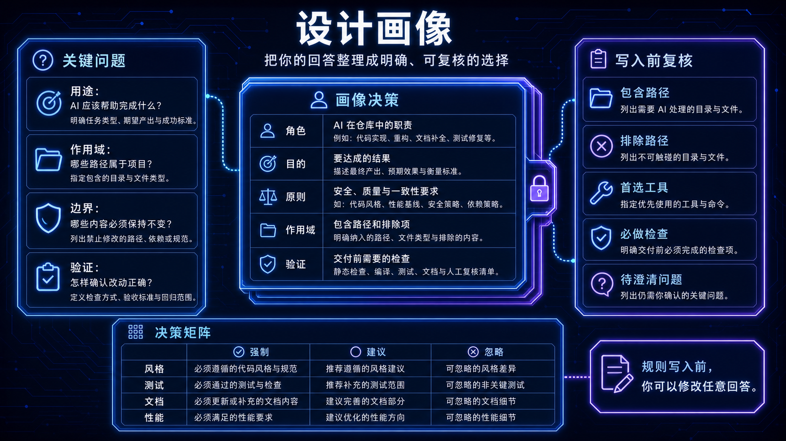
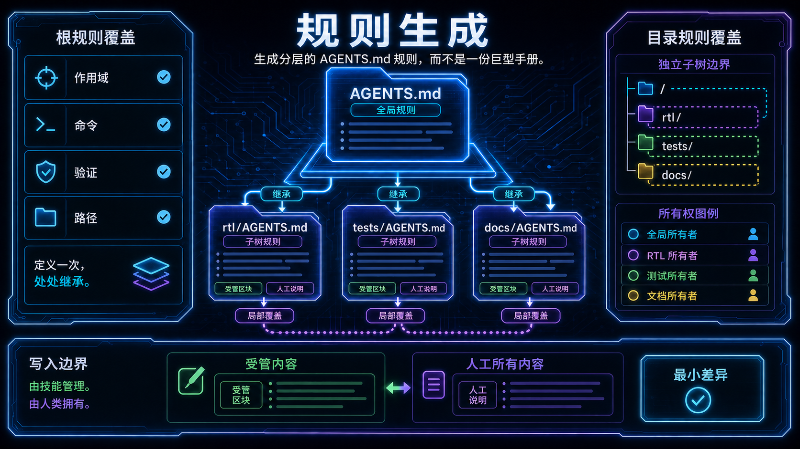

<p align="center">
  <a href="README.md"><strong>English</strong></a>
  <span>&nbsp;|&nbsp;</span>
  <a href="README-CN.md">中文</a>
</p>

<p align="center">
  
</p>

<p align="center">
  <a href="LICENSE"></a>
  <a href="pyproject.toml"></a>
  
  <a href="SKILL.md"></a>
  <a href="references/script-guide.md"></a>
</p>

<h1 align="center">AGENTS.md Generator</h1>

<p align="center">
  面向 Codex 的技能，把真实仓库整理成清晰、分层、可执行的 Agent 协作规则。
</p>

<p align="center">
  最新版本：<strong>v2.1.1</strong> · 发布日期：<strong>2026-08-11</strong>
</p>

AGENTS.md Generator 面向需要长期维护仓库的团队：它先理解真实存在的目录和工具，再帮助维护者决定规则作用域、继承方式和交付边界。仓库事实、分组设计对话、确定性渲染器、目录治理和发布工具被收拢在同一个技能包里，让规则能够跟随开发、交接、安装和镜像一起演进。

## 为什么维护者会选择它

- 把陌生仓库整理成短小、易导航的 Agent 上下文层。
- 让根规则和局部规则与实际目录边界保持一致。
- 让本地开发、验证、打包和安装始终沿用同一套意图。
- 为下一次接手工作的 Agent 提供清晰的继续路径。

## 01 —— 从仓库事实开始

技能从真实存在的目录树开始，识别项目形态、语言、命令面、维护边界和已有指导，再询问必须由维护者决定的策略。这样生成的第一版规则来自仓库本身，而不是凭空套用模板。



## 02 —— 写入前先对齐策略

分组设计问题把作用域、继承、命名、远程路由和发布边界变成明确选择。画像确定后，生成器只维护受管区块，人工说明仍然由维护者掌握。



## 03 —— 让流程贯穿发布

生成器只写入自己负责的区块，保留文件其余内容，并对本地技能目录、版本化 dist 目录和已有 GitHub checkout 使用同一份包合同。这样工作可以继续、审阅、安装和维护，而不会在每个交付节点改变含义。



## 开始使用

在仓库中运行设计和验证流程：

```powershell
python skills/agents-md-generator/scripts/python/design/collect_design_profile.py --project .
python skills/agents-md-generator/scripts/python/verify/quick_validate.py skills/agents-md-generator
python skills/agents-md-generator/scripts/python/verify/audit_skill.py skills/agents-md-generator
```

正式安装只接受版本化目录：

```powershell
python skills/agents-md-generator/scripts/python/release/install_skill.py `
  dist/agents-md-generator-v2.1.1 --target skip
```

## 本地开发与 GitHub 镜像

README 和流程变化只在源技能目录中编写；发布包从源目录生成，已有 `github/` checkout 只接收选定的完整 dist 内容。本地开发、安装和远程发布仍然是彼此独立的决定。

```powershell
python skills/agents-md-generator/scripts/python/release/github_skill_release.py `
  status --project . --skill-dir skills/agents-md-generator
python skills/agents-md-generator/scripts/python/release/github_skill_release.py `
  check --project . --skill-dir skills/agents-md-generator
python skills/agents-md-generator/scripts/python/release/github_skill_release.py `
  mirror --project . --skill-dir skills/agents-md-generator `
  --release-dir dist/agents-md-generator-v2.1.1
python skills/agents-md-generator/scripts/python/release/github_skill_release.py `
  verify --project . --skill-dir skills/agents-md-generator `
  --release-dir dist/agents-md-generator-v2.1.1
```

镜像工具保留 `.git`，用选定 dist 包替换 checkout 的其余内容，并比较替换后的文件；它不会替你创建远程仓库，也不会执行 `commit`、`push`、`tag` 或 GitHub Release。

## 技能包包含什么

| 能力 | 维护者得到的结果 |
| --- | --- |
| 仓库发现 | 项目形态和维护边界的紧凑地图 |
| 策略对齐 | 与目录实际用途匹配的分层规则 |
| 确定性渲染 | 可重复生成且不抹掉人工说明的受管区块 |
| 目录治理 | 根目录、嵌套作用域和交接状态的清晰门禁 |
| 发布生命周期 | 可以一致安装或镜像的版本化技能包 |

## 作者与引用

Jiyuan Liu 和 He Li 来自东南大学（Southeast University）电子科学与工程学院。本项目与 Heterogeneous Intelligence and Quantum Computing Laboratory (HIQC) 共同开发。

如果你的工作使用了本技能，请通过 [CITATION.cff](CITATION.cff) 引用：

```bibtex
@software{liu_2026_agents_md_generator,
  author = {Jiyuan Liu and He Li},
  title = {{AGENTS.md Generator}: An Agent Skill for Coding-Agent Context Files},
  year = {2026},
  version = {2.1.1},
  date = {2026-08-11},
  url = {https://github.com/Eriemon/agents-md-generator},
  license = {Apache-2.0}
}
```

本技能采用 Apache License 2.0。请阅读 [LICENSE](LICENSE)、[CONTRIBUTING.md](CONTRIBUTING.md)、[SECURITY.md](SECURITY.md) 和 [CITATION.cff](CITATION.cff)。
