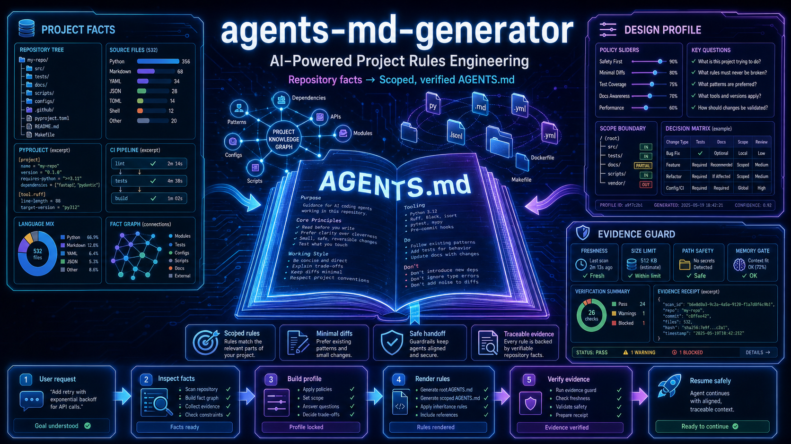
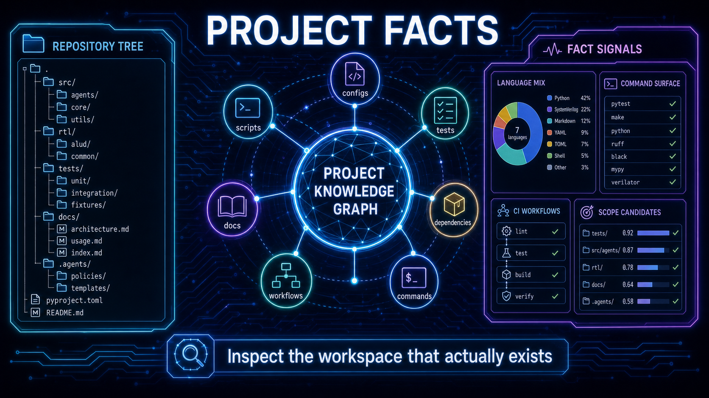
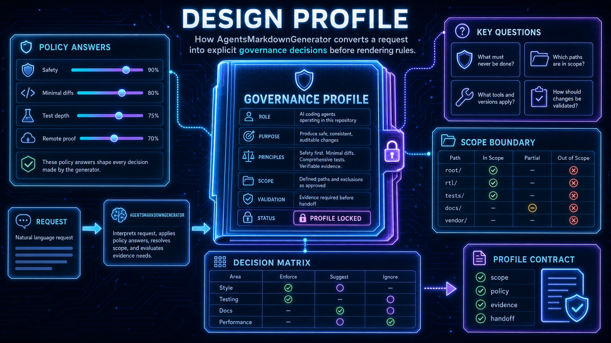
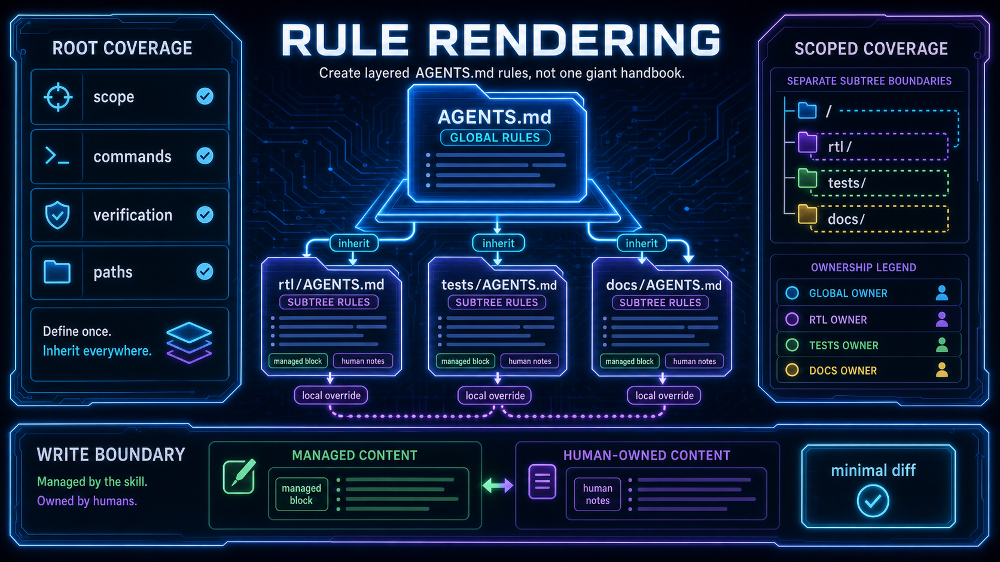
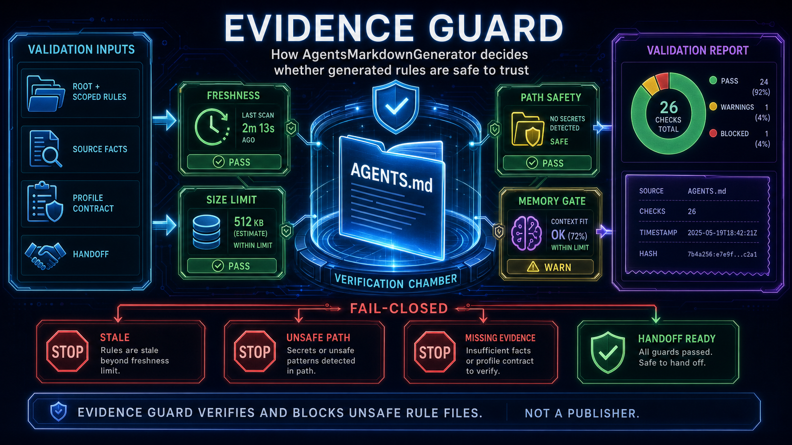

# AGENTS.md Generator



Turn a messy repository handoff into a compact, scoped, reviewable set of coding-agent rules. The skill reads the workspace that actually exists, asks only for policy that cannot be inferred, renders managed blocks, and leaves evidence for the next session.

## The product in one sentence

`repository facts + confirmed intent → scoped AGENTS.md + governance evidence`

The generator is designed for maintainers who need the same answer to remain true across a local checkout, a remote validation workspace, an interrupted session, and a versioned release package.

## What it handles

| Need | What the skill does | Result you can inspect |
| --- | --- | --- |
| New or missing root rules | Detects the project kind and asks the design groups in order | A root and scoped `AGENTS.md` plan |
| Existing rules | Preserves text outside managed blocks and updates only governed content | A minimal diff with ownership boundaries |
| Large workspaces | Compresses rules around decisions, paths, and gates | A short operational root instead of a handbook |
| Remote work | Resolves the configured route and checks the verified workspace | Server, task, and workspace evidence |
| Interrupted work | Reads the current handoff and resumes the exact step | A safe stop/resume point |
| Skill releases | Audits, packages, installs, and records a versioned receipt | `dist/<skill>-vX.Y.Z/RELEASE_RECEIPT.json` |
| GitHub-linked skills | Mirrors a completed dist package into an existing `github/` checkout | A manifest, local plan, and separate publication boundary |

## Functional views

The hero is the overview. These four detail views show the actual contracts behind the workflow: what is inspected, how policy is locked, where rules are rendered, and why a handoff is safe to trust.









## A real request

```text
Create a root AGENTS.md for this repository, keep the root under 20 KB,
put FPGA rules under rtl/, validate on the selected remote server, and
prepare a release package without installing it.
```

The skill turns that request into explicit answers, checks whether the workspace already has meaningful content, renders only after alignment, and reports which checks were actually run. It does not invent a server, silently copy local references, or call a remote publication command.

## Installable entry points

Run from this repository while developing the skill:

```powershell
python skills/agents-md-generator/scripts/python/design/collect_design_profile.py --project .
python skills/agents-md-generator/scripts/python/verify/quick_validate.py skills/agents-md-generator
python skills/agents-md-generator/scripts/python/verify/audit_skill.py skills/agents-md-generator
```

Install only from a validated versioned directory, never from the source directory:

```powershell
python skills/agents-md-generator/scripts/python/release/install_skill.py `
  dist/agents-md-generator-v2.1.0 --target skip
```

## Linking an existing GitHub repository

When a skill also has a public repository, register its mapping in `.agents/agents-control.json` and follow this order:

```text
status → check → normal dist release/install → mirror → plan →
separate publication confirmation → manual git/gh actions → verify
```

The local helper is deliberately fail-closed:

```powershell
python skills/agents-md-generator/scripts/python/release/github_skill_release.py `
  check --project . --skill-dir skills/agents-md-generator
python skills/agents-md-generator/scripts/python/release/github_skill_release.py `
  mirror --project . --skill-dir skills/agents-md-generator `
  --release-dir dist/agents-md-generator-v2.1.0
```

It preserves `.git`, replaces every other checkout entry with the dist contents, compares SHA-256 manifests, and never creates a remote repository or performs `commit`, `push`, `tag`, or GitHub Release actions.

## Public package contract

Every managed skill package contains `VERSION`, `LICENSE`, `README.md`, `README-CN.md`, `SECURITY.md`, `pyproject.toml`, `CONTRIBUTING.md`, `CITATION.cff`, and `SKILL.md`. Both README files use local raster PNG illustrations; SVG, Mermaid, remote image URLs, and placeholder metadata are rejected before packaging.

When this skill is used to create or update another skill, a request for README illustrations follows the same visual contract: use Image2/ImageGen to create original raster artwork, make the main image a wide 16:9 functional overview, add matching detail images for the core capabilities, and show real inputs, decisions, outputs, gates, or data relationships. Decorative screenshots, generic step lists, SVG illustrations, Mermaid diagrams, and remote image links do not satisfy the contract.

## Design principles

- Facts before prose: inspect the current tree before asking a question.
- Narrow writes: managed blocks are generated; human notes remain human-owned.
- Evidence before confidence: a receipt names the source, package, and checks that produced it.
- Separate scopes: local mirror, installation, and remote publication each have their own confirmation boundary.

## License and citation

Released under Apache-2.0. See [LICENSE](LICENSE), [CONTRIBUTING.md](CONTRIBUTING.md), [SECURITY.md](SECURITY.md), and [CITATION.cff](CITATION.cff).
