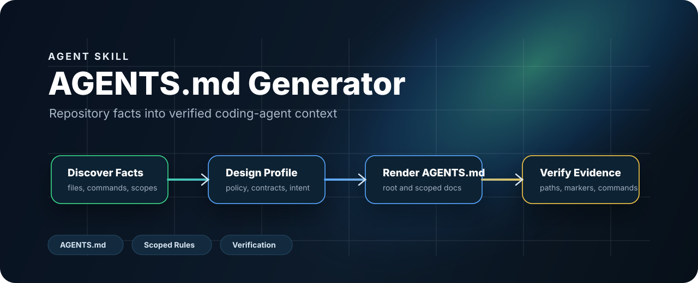
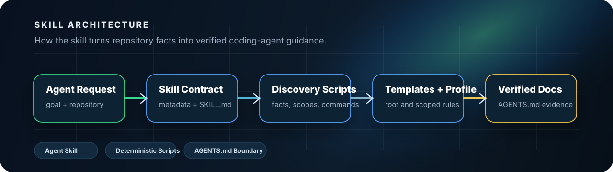
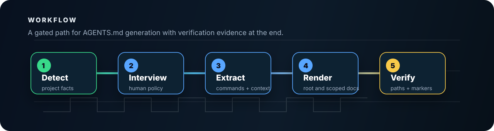

<p align="center">
  <a href="README.md"><strong>English</strong></a>
  <span>&nbsp;|&nbsp;</span>
  <a href="README-CN.md">中文</a>
</p>

<p align="center">
  
</p>

<p align="center">
  <a href="LICENSE"></a>
  <a href="pyproject.toml"></a>
  
  <a href="SKILL.md"></a>
  <a href="references/script-guide.md"></a>
</p>

<h1 align="center">AGENTS.md Generator</h1>

<p align="center">
  A Codex-ready skill for generating, repairing, and verifying AGENTS.md governance from repository facts.
</p>

AGENTS.md Generator helps coding agents produce instruction files that stay grounded in the real repository instead of drifting into guessed policy. It combines trigger metadata, grouped design interviews, deterministic Python scripts, docs-governance helpers, directory-governance gates, and verification checks so an agent can move from repository facts to trustworthy `AGENTS.md` output.

This repository is primarily an **agent skill package**. The Python scripts are the deterministic execution layer; the main product is the skill workflow an agent can load and follow.

## What It Solves

Handwritten agent rule files become stale quickly. Commands stop matching the repo, path references drift, and local operating rules get duplicated in inconsistent places. AGENTS.md Generator gives the agent a stricter path:

- inspect the repository first
- ask only for missing human policy
- keep root and scoped `AGENTS.md` files small and focused
- route docs governance, directory governance, and release governance through scripts
- verify that metadata, paths, contracts, and reply-language rules are actually consistent

## Core Capabilities

- Root and scoped `AGENTS.md` generation for Codex-style coding agents.
- Grouped design interviews with resumable state and explicit confirmation gates.
- Controlled takeover flow for older workspaces with version-mismatched root `AGENTS.md`.
- Repository fact extraction for commands, docs, CI hints, scopes, and governance signals.
- Strong-control profiles for skill and engineering projects.
- Docs governance for handoff, memory, development, install, and git-manager records.
- Directory-governance review and structure gates through `scripts/python/dirs/manage_dirs.py`.
- Compatibility shim generation for `CLAUDE.md` and `GEMINI.md` when requested.
- Verification, audit, automated review governance, skill-effectiveness evals, and aggregate confidence checks for release readiness.

## What's New In v1.4.1

- Moves the governance runtime from flat `scripts/*.py` files into `scripts/python/<domain>/...`, separating common, detect, design, docs, dirs, release, render, and verify entry points.
- Retires evolution and `docs/experience` governance paths. Long-term project context now belongs in `docs/memory`, with memory gate, init, bootstrap, read, and verify flows.
- Extends the default-language rule to Plan Mode so generated `<proposed_plan>` content follows the configured project language unless the user explicitly switches languages.
- Strengthens lightweight task entry with `task_rating_gate.py`, reuse-first guidance, language-specific coding skill routing, script-output policy checks, and config-backed source governance.
- Hardens release and directory governance: external workspaces must call the installed `agents-md-generator` runtime instead of vendoring these scripts, release packages reject local validation artifacts, and GitHub/package publishing requires sanitized package evidence.

## Skill Architecture

<p align="center">
  
</p>

## Workflow

<p align="center">
  
</p>

## Typical Paths

1. Healthy workspace root:
   Run `inspect_project.py`, confirm the root `AGENTS.md` is healthy, and report pass status for workspace-trigger phrases related to planning or preparation.
2. Explicit AGENTS update:
   Start the grouped interview, collect the missing policy, render root/scoped files, then verify.
3. Version-mismatched old workspace:
   Enter takeover mode, keep identity questions minimal, still complete the structured directory contract, then repair governance.
4. Strong-control release flow:
   Run `quick_validate.py`, `audit_skill.py`, `verify_agents.py`, `evaluate_skill.py`, and the review/eval gates before packaging or installation.

## Repository Map

| Path | Purpose |
| --- | --- |
| `SKILL.md` | Agent-facing routing, workflow, constraints, and verification rules. |
| `agents/openai.yaml` | Skill metadata used by the host UI. |
| `scripts/python/` | Deterministic inspection, interview, rendering, docs-governance, directory-governance, verification, audit, and evaluation helpers. |
| `assets/templates/` | Bundled root and scoped `AGENTS.md` templates used by the current release flow. |
| `evals/` | Repo-local skill-effectiveness cases and release-safe evaluation data used by the governance tooling. |
| `references/` | Script guide, review checklist, question bank, capability notes, and AGENTS guidance. |
| `docs/assets/` | Hero, workflow, and architecture diagrams used in this README pair. |

## Install

Tell your AI assistant: install https://github.com/Eriemon/agents-md-generator

Manual setup:

```powershell
git clone https://github.com/Eriemon/agents-md-generator.git
cd .\agents-md-generator
python -m pip install -e .
```

If you use Codex or another skill-aware host, place this repository in the host's skill search path and restart the host after installation.

## Quick Start

Read-only inspection and scoping:

```powershell
python scripts/python/detect/inspect_project.py <project>
python scripts/python/detect/detect_scopes.py <project>
python scripts/python/detect/extract_commands.py <project>
python scripts/python/detect/extract_context.py <project>
```

Grouped design interview and profile write:

```powershell
python scripts/python/design/collect_design_profile.py <project> --start
python scripts/python/design/collect_design_profile.py <project> --answer-file partial.json
python scripts/python/design/collect_design_profile.py <project> --answers answers.json --write
```

Render and verify:

```powershell
python scripts/python/render/render_agents.py <project> --profile <project>/.agents/agents-control.json
python scripts/python/verify/verify_agents.py <project>
python scripts/python/docs/manage_docs.py verify <project>
```

Codex token usage review:

```powershell
python scripts/python/detect/codex_token_usage_review.py --hours 48
python scripts/python/detect/codex_token_usage_review.py --hours 48 --json
python scripts/python/detect/codex_token_usage_review.py --hours 48 --verbose
```

Skill-release validation:

```powershell
python scripts/python/verify/quick_validate.py .
python scripts/python/verify/audit_skill.py .
python scripts/python/verify/evaluate_skill.py . <project>
```

Source-repository note:

- This repository no longer keeps repo-local `tests/` under version control.
- Installable release policy rejects `tests/`, `smoke*`, `reports/`, and cache artifacts from packaged outputs.

Advanced governance-sensitive release checks:

```powershell
python scripts/python/verify/review_governance.py <project> --base <sha> --head HEAD --skill-dir . --mode all
python scripts/python/verify/run_confidence_gate.py <project> --review-base <sha> --external-skill-dir <healthy-skill-dir>
```

Compatibility shims stay opt-in:

```powershell
python scripts/python/render/create_agent_shims.py <project>
```

## Scope

AGENTS.md Generator is intentionally narrow:

- It creates and reviews agent-governance files, not general project documentation.
- It treats discovered commands as candidates until they are actually executed.
- It preserves handwritten content outside managed generated blocks.
- It keeps maintainability and script-governance detail in config-backed policy instead of repeating it everywhere in prose.
- External projects should call the installed runtime, for example `python <codex-home>/skills/agents-md-generator/scripts/python/docs/manage_docs.py ...`, rather than copying this skill's scripts into project-local tool folders.
- It should not emit secrets, private infrastructure details, generated caches, or machine-specific absolute paths.

## Affiliation

Jiyuan Liu and He Li are with the School of Electronic Science and Engineering, Southeast University.
They are affiliated with the Heterogeneous Intelligence and Quantum Computing Laboratory (HIQC), which works on heterogeneous intelligence, quantum computing, and related computing systems research.

## Contact

For questions, collaboration, or academic use, contact: [erie@seu.edu.cn](mailto:erie@seu.edu.cn).

## Citation

If this skill helps your research, teaching, or engineering workflow, please cite it. The canonical citation metadata is maintained in [CITATION.cff](CITATION.cff).

```bibtex
@software{liu_2026_agents_md_generator,
  author       = {Jiyuan Liu and He Li},
  title        = {{AGENTS.md Generator}: An Agent Skill for Coding-Agent Context Files},
  year         = {2026},
  version      = {1.4.1},
  date         = {2026-06-27},
  url          = {https://github.com/Eriemon/agents-md-generator},
  license      = {Apache-2.0},
  note         = {Agent skill package for generating and verifying AGENTS.md files}
}
```

## License

Apache License 2.0. See [LICENSE](LICENSE).
