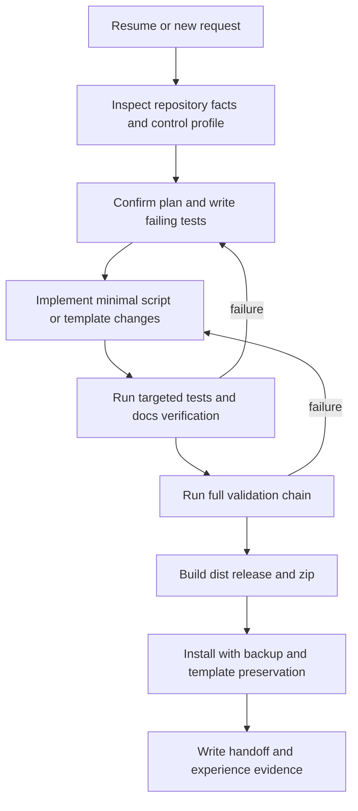

# Workflow Evolution Template

- Template family: engineering-template
- Target type: skill-repo
- Source file: 1-workflow.md
- Version window: current-plus-latest-history

## Source Versions
- `docs/experience/1-workflow.md`
- `docs/experience/history_experience/20260512-165633/1-workflow.md`

## Reusable Lessons
- Plan mode must stay evidence first: inspect real repository facts before changing scripts, then write a failing test, implement narrowly, and verify before handoff. This prevents generated governance from drifting away from actual files.
- 完整流程链: resume-check -> repository fact inspection -> intent confirmation -> plan -> failing regression test -> narrow implementation -> targeted verification -> full validation -> release packaging -> install confirmation -> handoff. Each stage must consume evidence from the previous stage and emit a concrete artifact for the next stage.
- 完整逻辑链: user policy becomes `.agents/agents-control.json`; the control profile drives AGENTS.md and docs scaffolding; docs governance collects handoff and conversation evidence; AI-authored experience payloads refresh lessons; validated lessons evolve templates; release packaging mirrors verified source; installation backs up the old skill before replacing it.
- 闭环: a failure returns to the earliest responsible evidence step. If tests fail, return to implementation; if experience quality fails, regenerate the AI payload from evidence; if dist parity fails, rebuild release artifacts; if installation reports template conflicts, preserve both versions and manually merge before claiming user templates are incorporated.
- For FPGA or Vivado engineering projects, the same workflow becomes: engineering Tcl planning -> create project -> HLS/Verilog development -> XDC constraints -> simulation -> simulation log/result closure -> debug insertion -> synthesis -> implementation -> bitstream -> resource/timing/power/DRC analysis -> download validation -> human intervention. The reusable rule is that every stage has an input contract, output artifact, and feedback path.

- Plan mode must stay evidence first: inspect real repository facts before changing scripts, then write a failing test, implement narrowly, and verify before handoff. This prevents generated governance from drifting away from actual files.
- 完整流程链: resume-check -> repository fact inspection -> intent confirmation -> plan -> failing regression test -> narrow implementation -> targeted verification -> full validation -> release packaging -> install confirmation -> handoff. Each stage must consume evidence from the previous stage and emit a concrete artifact for the next stage.
- 完整逻辑链: user policy becomes `.agents/agents-control.json`; the control profile drives AGENTS.md and docs scaffolding; docs governance collects handoff and conversation evidence; AI-authored experience payloads refresh lessons; validated lessons evolve templates; release packaging mirrors verified source; installation backs up the old skill before replacing it.
- 闭环: a failure returns to the earliest responsible evidence step. If tests fail, return to implementation; if experience quality fails, regenerate the AI payload from evidence; if dist parity fails, rebuild release artifacts; if installation reports template conflicts, preserve both versions and manually merge before claiming user templates are incorporated.
- For FPGA or Vivado engineering projects, the same workflow becomes: engineering Tcl planning -> create project -> HLS/Verilog development -> XDC constraints -> simulation -> simulation log/result closure -> debug insertion -> synthesis -> implementation -> bitstream -> resource/timing/power/DRC analysis -> download validation -> human intervention. The reusable rule is that every stage has an input contract, output artifact, and feedback path.

