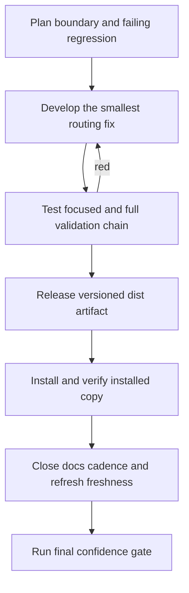

# Workflow Evolution Template

- Template family: skill-template
- Category path: agent-governance
- Target type: governance-workflow
- Source file: 1-workflow.md
- Version window: current-plus-latest-history
- Target source: ai
- Rationale: Inferred from project control profile, repository facts, and topic keywords.
- Source workspace: current governed workspace (local path intentionally omitted)
- Source project: agents-md-generator
- Source handoff window: 76-80

## Source Versions
- `docs/experience/1-workflow.md`
- `docs/experience/history_experience/20260527-171409/1-workflow.md`

## Evidence Sources
- Current and previous workflow experience files, the latest handoff window, release/install evidence, and the current control profile.

## Applicable Scenario
- Use when a skill-governance repository must split owner-repo bootstrap commands from external installed-runtime commands while keeping release and install proof in the same conversation.

## Distilled Workflow
- Inspect repository facts and current AGENTS control profile before changing command routing.
- Decide which commands belong to owner-repo bootstrap, which belong to installed governance runtime, and which belong to the target project itself.
- Write paired regressions for owner and external paths, implement the smallest routing fix, rerun verify/eval/review gates, rebuild the release, validate install, then close docs cadence and freshness in the same conversation.
- Workflow phase plan: plan the boundary and failing regressions, develop the narrow routing fix and companion docs updates, test the focused and full validation chain, then release the versioned artifact and install it before claiming closure.

## Key Decisions
- External workspaces call the installed `agents-md-generator` runtime rather than vendoring governance scripts into project-local folders.
- Owner repositories keep explicit local bootstrap commands so self-development remains deterministic.
- Release and install evidence are mandatory before claiming the workflow change is complete.
- The design pattern mix is Tool Wrapper + Reviewer + Pipeline: governance scripts stay skill-owned, reviewer gates block drift, and the release/install/docs chain enforces closure order.

## Common Problems
- Mixed command ownership causes users to normalize unsafe vendoring behavior.
- Green source tests without rebuilt release/install evidence create false confidence.
- Late docs cadence requests can keep the repository non-current even after release and install are green.

## Process Notes
- 完整流程链: repository fact inspection -> boundary classification -> failing regression plan -> narrow develop step -> targeted test and full validation -> release packaging -> install proof -> docs cadence closeout -> freshness refresh -> final confidence gate.
- 完整逻辑链: the AGENTS/control-profile contract defines command ownership; tests prove the previous routing was unsafe; reviewer and verifier gates keep docs/evals aligned; release receipts and installed-copy audit prove the artifact teaches the same behavior as source.
- 闭环: if any later gate turns red, return to the earliest broken proof stage, fix it there, and replay the remaining pipeline stages instead of patching around the last failure.

## Non-Reusable Content
- Do not copy temporary backup paths, one-off timestamps, or local machine-specific release directories into the reusable template.
- Do not paste full handoff text into the workflow template; keep only the repeatable decision and verification sequence.

## Application Checklist
- Confirm repository fact inspection happened before synthesis.
- Confirm AGENTS or agent-governance rule alignment is explicit.
- Confirm scripts, tests, verify, and docs governance steps are present before release/install closure.
- Confirm release or install decision handling appears before the workflow claims completion.
