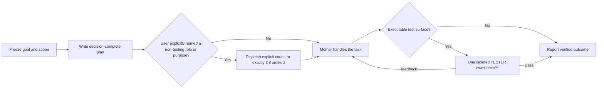

# AGENTS.md Guidance

AGENTS.md is an operational context file for AI coding agents. Human readability is useful, but agent accuracy is the goal.

## Table of Contents

- [Core Principles](#core-principles)
- [Global Planning And Testing Governance](#global-planning-and-testing-governance)
- [Skill Design Patterns](#skill-design-patterns)
- [Engineering Rule Essence](#engineering-rule-essence)
- [Root AGENTS.md Sections](#root-agentsmd-sections)
- [Scoped AGENTS.md Sections](#scoped-agentsmd-sections)
- [What Not To Include](#what-not-to-include)
- [Compatibility](#compatibility)

## Core Principles

| Principle | Meaning |
|-----------|---------|
| Structured over prose | Use tables, maps, and short rules instead of long paragraphs |
| Never fabricate | Only document commands, files, tools, and rules that are discovered or explicitly supplied |
| Pointer principle | Link to README, docs, ADRs, configs, and examples instead of copying them |
| Verified commands | Mark commands unverified until they were actually run or dry-run checked |
| Thin root | Keep global defaults in root; move stack-specific rules into scoped files |
| Frozen scope | Record Goal, Success Criteria, In Scope, and Out of Scope; review defects without inventing features |
| Decision-complete planning | Specify execution inputs, outputs, files, failure handling, checks, and stop conditions before approval |
| Golden samples | One real reference file beats generic style advice |
| Heuristics | Encode quick decisions as `When / Do` tables |
| Preserve judgment | Keep human-curated boundaries, terminology, and codebase state outside generated blocks |

## Global Planning And Testing Governance

Use the global v4 contract only for cross-repository behavior. A formal solution or implementation plan freezes the requested goal and passes one bounded approval path:

All non-testing subagents are disabled by default, including solution/design/plan reviewers, implementation agents, and parallel workers. Only a proactive, explicit user request in the current task that names the role or purpose may enable them; a generic multi-agent request, complexity, ratings, risk, and agent judgment do not count as authorization. When the user omits the count, use exactly three; an explicit count overrides it, and authorization does not carry over. Work with an executable test surface still uses exactly one isolated TESTER. Pure read-only/planning work and documentation-only changes without a test surface do not require one. The mother agent never lists, reads, changes, or runs `tests/**`. Documents and plans may combine prose, tables, and Mermaid when the combination improves understanding; no format is mandatory by itself.

## Skill Design Patterns

Use these patterns to decide what belongs in the skill versus scripts or references.

| Pattern | Use in this skill |
|---------|-------------------|
| Map, not manual | Keep AGENTS.md as a navigation map; link to docs, configs, source, and scripts for details |
| Tool Wrapper | Wrap repeatable repository discovery and verification in Python scripts |
| Generator | Render predictable AGENTS.md sections from templates and extracted facts |
| Reviewer | Keep review gates in `review-checklist.md` and automate every check that can be made deterministic |
| Inversion | Ask only for human policy that files cannot reveal, such as risk boundaries and terminology |
| Pipeline | Run detect, extract, generate, verify, freshness, and compatibility steps in order |
| Compression | Keep only rules that change agent decisions; move repeated checks into scripts |

For Skill-development repositories, read `references/skill-design-coverage.md` and render a Skill Design Contract from confirmed profile answers. The contract must record trigger scenarios, selected design patterns, resource boundaries, progressive disclosure policy, validation gates, and forward-testing policy.

## Engineering Rule Essence

Borrow only decision-changing rules from engineering rule sets; do not paste book summaries into AGENTS.md.

| Risk | AGENTS.md guidance |
|------|--------------------|
| Accidental complexity | Prefer fewer concepts, clear ownership, and deep modules over shallow wrappers |
| Unsafe refactoring | Require small verified steps and separate behavior changes from cleanup |
| Legacy uncertainty | Characterize current behavior before changing poorly tested code |
| Production fragility | Document failure semantics, bounds, recovery, and observability for risky paths |
| Hidden data contracts | State data contracts, source of truth, compatibility, retries, and migration paths |
| Domain confusion | Record bounded context, domain terms, and translation boundaries when business meaning matters |

Use `mini`-style summaries for optional engineering guidance: short triggers, decision rules, and final checks. Keep full rule sources outside AGENTS.md and never copy book summaries into generated output.

When a book-derived rule set is used, choose exactly one primary rule set. Use `mini` for normal focused work, `nano` for tight always-on budgets, and keep `full` reference-only. Record the chosen rule set, mode, scope, and notes in `.agents/agents-control.json`, then render only the Engineering Rule Contract into AGENTS.md.

## Root AGENTS.md Sections

| Section | Purpose |
|---------|---------|
| Precedence | State closest AGENTS.md wins; user prompt overrides files |
| Control Profile | Summarize confirmed development type, name, purpose, reason, and temporary-reference policy |
| Directory Contract | Freeze local, remote, and feature-addition directory structures after user confirmation |
| Release Contract | Freeze local git, branch, dist folder, release folder, and zip package expectations |
| Engineering Rule Contract | Record the chosen mini/nano engineering rule set, scope, compatibility boundary, and reference-only full-material rule |
| Skill Design Contract | For Skill projects, record trigger scenarios, Skill patterns, resource boundaries, progressive disclosure, validation gates, and forward-testing policy |
| Commands | Executable commands with source, verification status, and rough time |
| File Map | Directory navigation hints |
| Golden Samples | Canonical files and patterns to follow |
| Utilities | Existing helpers to reuse before creating new ones |
| Heuristics | Quick decision rules |
| Repository Settings | Package manager, CI, merge style if known |
| Hook Policy | Detected hook frameworks and rules for never bypassing hooks |
| CI Rules | Quality gates visible in workflows |
| GitHub Settings | CODEOWNERS, Copilot instructions, dependency automation, and rulesets |
| Directory Coverage | Major directories that may need scoped AGENTS.md files |
| Key Decisions | Links to ADRs or architecture docs |
| Boundaries | Always / Ask First / Never |
| Codebase State | Verified migrations, tech debt, known risks |
| Terminology | Domain terms agents may misunderstand |
| Scoped Index | Links to scoped AGENTS.md files |
| Documentation Governance Contract | Require `docs/handoff/HANDOFF.md`, handoff history rotation, `docs/memory/` long-term context, stage records, install configuration, git manager records, local and remote deployment `docs/dir_manager/` folder-change review, and `history_dir_manager/` archival before force-confirmed blocked directory changes |

## Scoped AGENTS.md Sections

Scoped files are useful when a directory has distinct commands, testing patterns, framework rules, or safety boundaries.

| Section | Purpose |
|---------|---------|
| Scope | Directory and precedence |
| Commands | Local commands or pointer back to root |
| Testing | Local test conventions and fixtures |
| Project Structure | Key files and subdirectories |
| Code Style | Local naming, imports, formatting, generated files |
| Git Workflow | Local commit/review notes if different |
| Boundaries | Local Always / Ask First / Never |
| When Stuck | What to inspect before guessing |
| House Rules | Human-maintained local exceptions |

## What Not To Include

| Avoid | Better |
|-------|--------|
| Product history | Link to README or docs |
| Marketing copy | One factual project sentence |
| Full architecture essays | Link to architecture docs and list boundaries |
| Guessed commands | Omit or ask the user |
| Repeated docs | Point to the source file |
| Aspirational checks | Mark missing checks as a gap, not a command |

## Compatibility

- Codex reads AGENTS.md natively and supports nested files.
- GitHub Copilot, Cursor, Windsurf, Devin, and several other tools support AGENTS.md or scoped rule files.
- Claude Code and Gemini CLI benefit from `CLAUDE.md` and `GEMINI.md` symlinks/shims next to every AGENTS.md.
- Never overwrite an existing non-managed compatibility file.
